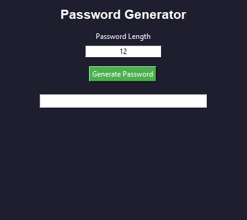

Random Password Generator

Description

A simple Python program to generate random passwords.

Technology Used

Python

Features

- Random password generation
- Uppercase and lowercase letters
- Numbers
- Special characters
- Custom password length

Output

Author

Nitin Kumar
