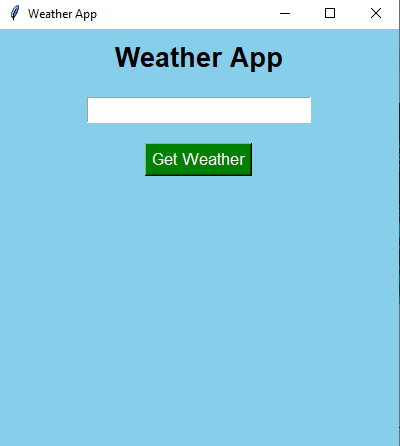

# Weather App

## Description
A simple Python-based Weather App that provides weather information for a selected city using a weather API.

## Features
- Search weather by city name
- Displays current weather information
- Shows temperature and weather conditions
- Simple and user-friendly interface

## Technology Used
- Python
- Weather API

## How to Run
1. Make sure Python is installed.
2. Install the required libraries.
3. Add your weather API key.
4. Run the Python file.
5. Enter a city name to get the weather information.

## Output

## Author
Nitin Kumar
