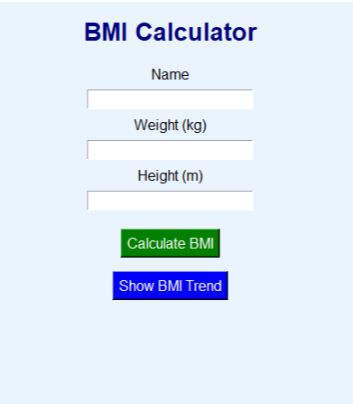

# BMI Calculator

## Description
This is a simple BMI (Body Mass Index) Calculator made using Python. It calculates BMI based on the user's height and weight and shows the health category.

## Features
- Calculate BMI
- Easy to use
- Simple GUI
- Shows BMI category

## Technologies Used
- Python
- Tkinter

## How to Run
1. Download the project.
2. Open the project folder.
3. Run:

```bash
python bmi_calculator.py
```
## output


## Author
Nitin Kumar
